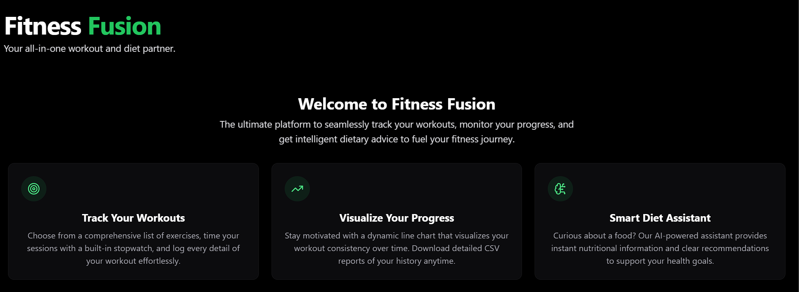
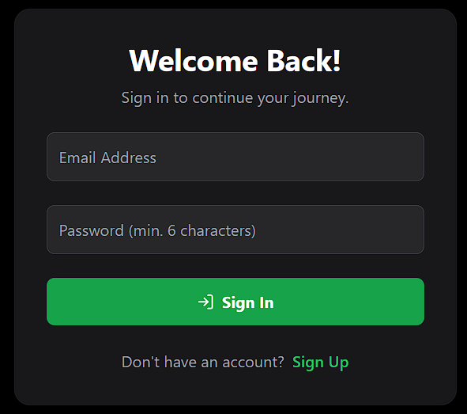
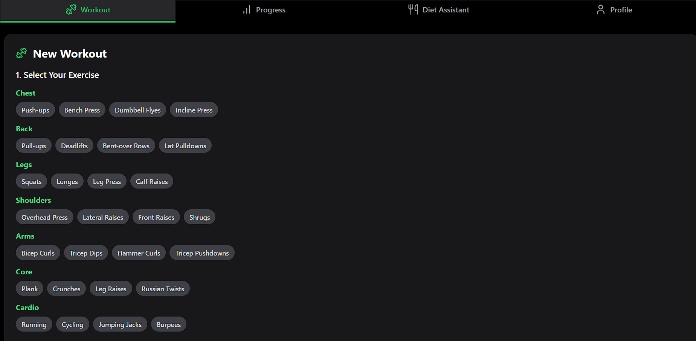
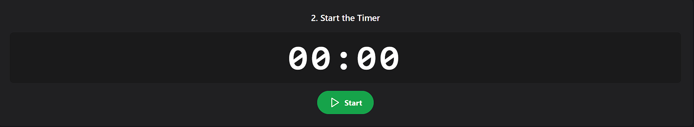
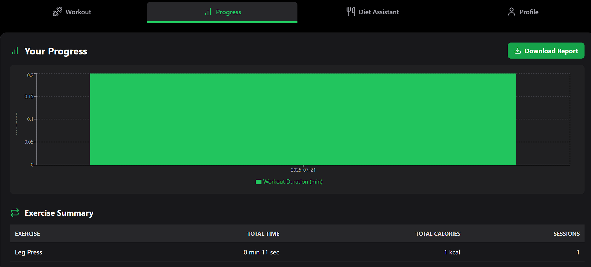
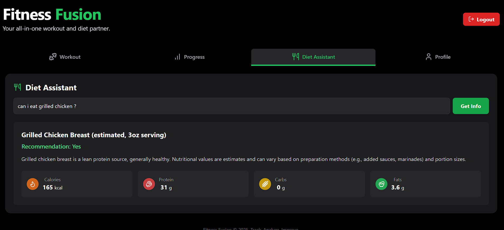

# Fitness Fusion - Your All-in-One Workout & Diet Tracker
Fitness Fusion is a modern, responsive web application designed to be your ultimate fitness companion. It allows users to seamlessly track their workouts, visualize their progress over time, and get intelligent, AI-powered dietary advice to support their health goals.
Check out here : https://fitness-fusion-pbx6.onrender.com

# ✨ Features
-> User Authentication: Secure user registration and login system using Firebase Authentication.

-> Personalized Profiles: Users can sign up with their name and age, which is displayed in a dedicated profile section.

# Workout Tracking:

Select from a comprehensive list of exercises categorized by muscle group.

An integrated timer to accurately track workout duration.

Automatic calculation of estimated calories burned per session.

# Progress Dashboard:

Visualize daily workout duration with an interactive bar chart.

View a detailed summary table of total time and calories burned for each exercise.

Downloadable Reports: Generate and download a workout report.

# AI Diet Assistant:

Ask about any food item in natural language.

Receive instant nutritional information (calories, protein, carbs, fats) and a clear recommendation, powered by the Google Gemini API.

Sleek & Responsive UI: A clean, modern interface built with Tailwind CSS that looks great on any device.

# 🚀 Tech Stack
Frontend: React

Backend & Database: Firebase (Authentication & Firestore)

Styling: Tailwind CSS

Charts: Recharts

PDF Generation: jsPDF & jspdf-autotable

AI: Google Gemini API

Icons: Lucide React

# 🏁 Getting Started
Follow these instructions to get a copy of the project up and running on your local machine for development and testing purposes.

Prerequisites
Node.js (which includes npm) installed on your machine.

A Firebase project set up with Authentication and Firestore enabled.

An API key from Google AI Studio for the Gemini API.

Installation
Clone the repository:

git clone https://github.com/your-username/fitness-fusion-app.git
cd fitness-fusion-app

Install NPM packages:

npm install

Set up environment variables:

Create a .env file in the root of your project.

Add your Firebase project configuration and your Gemini API key to this file. Each variable must be prefixed with REACT_APP_.

# Firebase Config
REACT_APP_FIREBASE_API_KEY="YOUR_FIREBASE_API_KEY"
REACT_APP_FIREBASE_AUTH_DOMAIN="YOUR_FIREBASE_AUTH_DOMAIN"
REACT_APP_FIREBASE_PROJECT_ID="YOUR_FIREBASE_PROJECT_ID"
REACT_APP_FIREBASE_STORAGE_BUCKET="YOUR_FIREBASE_STORAGE_BUCKET"
REACT_APP_FIREBASE_MESSAGING_SENDER_ID="YOUR_FIREBASE_MESSAGING_SENDER_ID"
REACT_APP_FIREBASE_APP_ID="YOUR_FIREBASE_APP_ID"
REACT_APP_FIREBASE_MEASUREMENT_ID="YOUR_FIREBASE_MEASUREMENT_ID"

# Gemini API Key
REACT_APP_GEMINI_API_KEY="YOUR_GEMINI_API_KEY"

Start the development server:

npm start

The application will be available at http://localhost:3000.

# 🚀 Deployment
This application is ready for deployment on static site hosting platforms like Render, Vercel, or Netlify.

When deploying, remember to configure the same environment variables that you set in your .env file in the deployment service's settings.

Build Command: npm install && npm run build

Publish Directory: build
